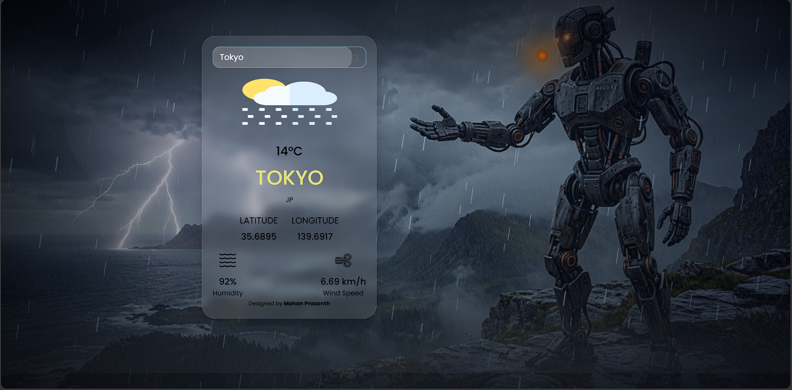

# 🌦 Weather App (React)

A modern weather application built using React that displays real-time weather data with a dynamic animated background.

---

## 🚀 Features

* 🌍 Search weather by city name
* 🌡 Shows temperature, humidity, wind speed
* 📍 Displays latitude & longitude
* 🎨 Glassmorphism UI design
* ⚡ Animated storm background (rain + lightning)
* 📱 Responsive layout

---

## 🛠 Tech Stack

* React (Vite)
* CSS (Glassmorphism + Animations)
* OpenWeather API

---

## 📂 Project Structure

```
Weather-App/
│
├── public/
├── src/
│   ├── assets/          # icons & images
│   ├── components/
│   │   ├── background.jsx
│   │   ├── background.css
│   │   ├── temp.jsx
│   ├── App.jsx
│   ├── App.css
│   ├── main.jsx
│
├── index.html
├── package.json
```

---

## ⚙️ Installation

1. Clone the repository

```
git clone https://github.com/mohan-prasanth-21/weather-app.git
```

2. Go to project folder

```
cd weather-app
```

3. Install dependencies

```
npm install
```

4. Run the app

```
npm run dev
```

---

## 🔑 API Setup

* Get API key from: https://openweathermap.org/api
* Replace in `App.jsx`:

```
let api_key = "YOUR_API_KEY";
```

---

## 📸 Preview



---

## 👨‍💻 Author

Mohan Prasanth

---

## 📄 License

This project is for learning purposes.
